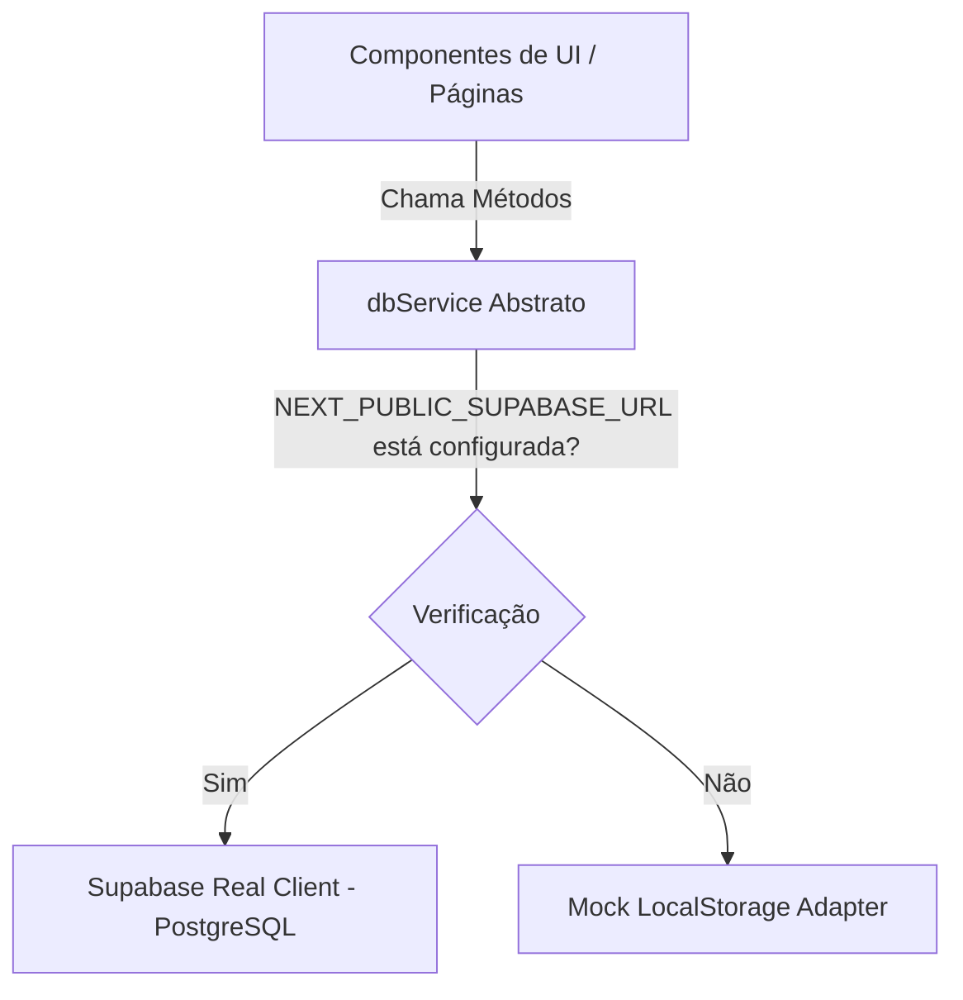

# Arquitetura do Sistema - ERP iWrc

Este documento detalha as decisões de arquitetura e a estrutura do ERP Interno da iWrc.

## 1. Visão Geral e Estrutura de Diretórios
O projeto foi modelado utilizando uma abordagem **baseada em Features** (Feature-Based Design), que agrupa os componentes, hooks, tipos e lógica de acesso a dados por funcionalidade do negócio, deixando a pasta `src/app/` apenas para a estrutura de rotas e layouts do Next.js.

### Mapeamento das Pastas:
* `src/features/auth/`: Contexto de autenticação, telas de login e logout. Suporta login real via Supabase Auth e login simulado para testes offline.
* `src/features/suppliers/`: Regras de negócio de fornecedores (cadastro, listagem, visualização 360º, contatos, endereços, materiais cadastrados).
* `src/features/prospecting/`: Visualização Kanban de prospecção comercial e tabela de leads com filtros.
* `src/features/logistics/`: Fila de análise e ficha de viabilidade de logística.
* `src/features/collections/`: Agendamento e gerenciamento de coletas com múltiplos materiais.
* `src/features/receipts/`: Registro de recebimentos de materiais pesados e fechamento de coleta.
* `src/features/shared/`: Lógica central do banco de dados híbrido (Dual-Mode DB Service) e utilitários.

---

## 2. Padrão Dual-Mode DB Service (Banco de Dados Híbrido)
Para permitir que o projeto seja testado imediatamente sem chaves do Supabase, o sistema utiliza um **Adaptador Abstrato** (`dbService`) que expõe métodos assíncronos idênticos para as duas implementações:

### Principais Benefícios:
1. **Zero Fricção de Setup**: O avaliador executa `npm run dev` e o sistema já funciona com dados pré-populados na memória/localStorage.
2. **Modularidade**: A UI não sabe de onde vêm os dados. Ao configurar o `.env.local` e rodar as migrations, o sistema conecta ao PostgreSQL automaticamente.

---

## 3. Segurança e Perfis de Acesso
No MVP, o sistema reconhece três níveis de perfil interno (`profiles.role`):
* **ADMIN**: Acesso total a todas as áreas, relatórios e controle de configurações.
* **BUYER** (Comprador/Comercial): Foco em prospecção, cadastro de fornecedores, registro de contatos, materiais e agendamento de coletas.
* **LOGISTICS** (Logística): Foco na fila de análise de fornecedores, avaliação de viabilidade técnica (transporte, custo, acondicionamento) e recebimento final dos materiais na balança.

No modo mock, a tela de login oferece atalhos rápidos para alternar entre os usuários e simular a experiência de cada papel no sistema.
